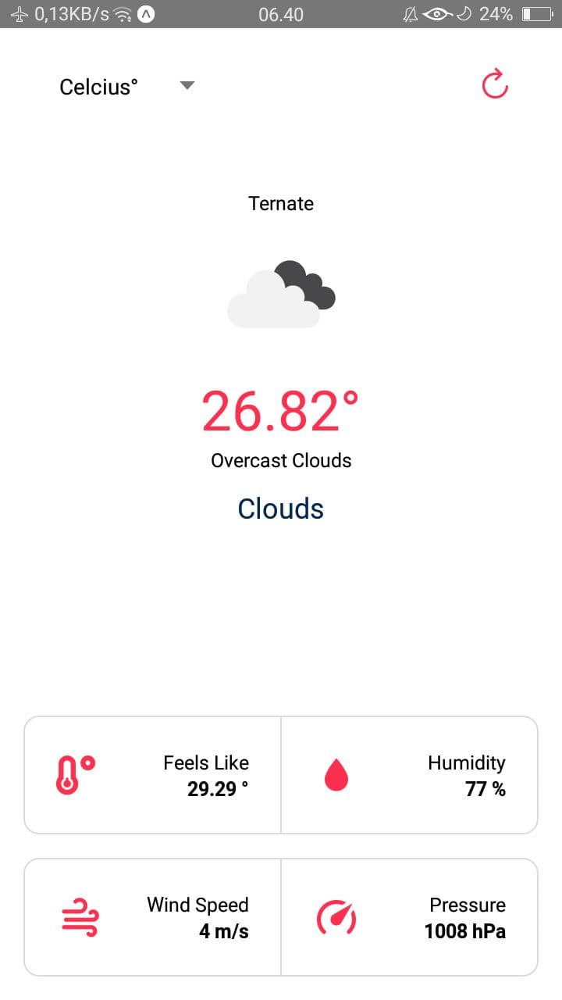

# Simple Weather App Using React Native

### How to?

* First clone this repository
> $git clone git@github.com:rizkhal/react-native-weather-app.git

* Install dependency
> npm install
or 
> yarn install

* Update your API TOKEN in .env file
WEATHER_API_KEY=[YOUR API TOKEN HERE]

Run it on your device or emulator
If successfully you can see the app like below

This project using API from [Open Weather Map](https://openweathermap.org/)
